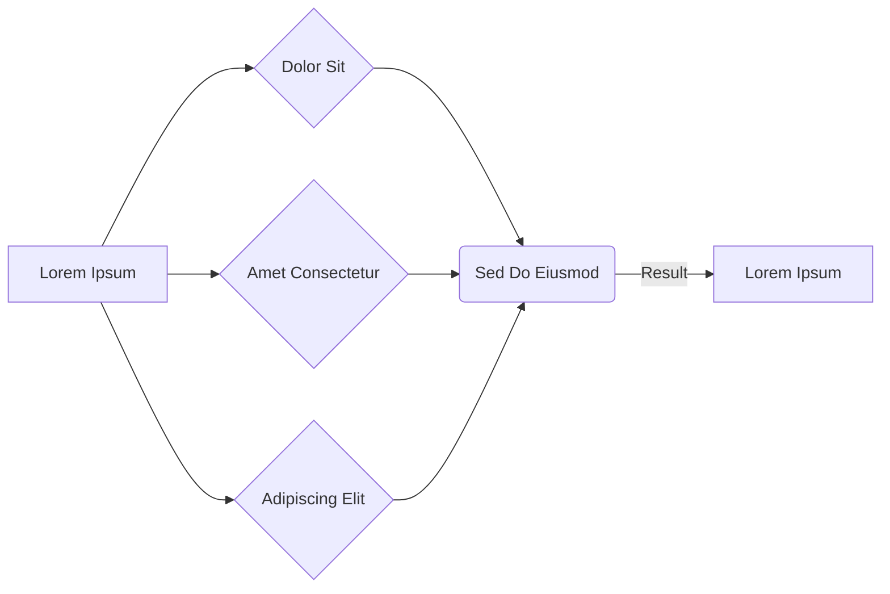

# Cover

## Author [John Doe](https://example.com)

<small class="text-sm">Lorem ipsum dolor sit amet, consectetur adipiscing elit.</small>

---
layout: about-me

helloMsg: Your Presenter
name: John Doe
position: left
school: "University Lecturer"
company: "Acme Corp"
website: "example.com"
website2: "example.org"
email: "john@example.com"
imageSrc: /assets/user.png
---


---
layout: quote
author: John Doe
---

Lorem ipsum dolor sit amet, consectetur adipiscing elit. Nullam in dui mauris. Vivamus hendrerit arcu.

---
layout: center
---

# Center

Lorem ipsum dolor sit amet, consectetur adipiscing elit.


---
layout: image-right
image: /assets/example.png
---

# Image Right

Lorem ipsum dolor sit amet, consectetur adipiscing elit. Nulla vehicula lobortis arcu.

- Pellentesque rutrum mattis
- **Phasellus mattis** libero
- Nam pulvinar varius egestas


---
layout: two-cols
---

# Two Columns

::left::

## Left

Lorem ipsum dolor sit amet, consectetur adipiscing elit. Cras suscipit mattis lectus at sagittis. 

::right::

Donec imperdiet elementum metus, et efficitur erat. Aenean volutpat nisl eget ante congue.


---
layout: image-left
image: /assets/example.png
---

# Image Left

Morbi mattis elementum magna at consectetur. Aenean iaculis est a orci volutpat varius. Nam pulvinar varius egestas, non pulvinar sapien.

- Fusce pulvinar elementum
- Vivamus dictum lectus
- Nullam in dui mauris


---
layout: two-cols-2-1
---

# Two Columns 2:1

::left::

## Left

Aliquam erat volutpat. Pellentesque rutrum mattis efficitur. Mauris tristique enim non tortor pellentesque, ac lacinia nunc tincidunt.

::right::

## Right

Donec pretium egestas tincidunt. Nam non mi mauris.


---
layout: timeline
---

::header::
# Timeline

::step1::
## 1. Vestibulum
Morbi mattis elementum magna at consectetur. Aenean iaculis est a orci volutpat varius.

::step2::
## 2. Integer 
Maecenas in ipsum in sem finibus eleifend. Mauris tristique enim non tortor pellentesque.

::step3::
## 3. Vivamus
Pellentesque habitant morbi tristique senectus et netus et malesuada fames ac turpis egestas.


---
layout: grid
---

# Grid

::tr::

## Top Right

```text
::tr::
```

::tl::

## Top Left

```text
::tl::
```

::br::

## Bottom Right

```text
::br::
```

::bl::

## Bottom Left

```text
::bl::
```

Pellentesque habitant morbi tristique senectus et netus et malesuada fames ac turpis egestas. Quisque id ligula magna.


---
layout: default
---

# Default

Lorem ipsum dolor sit amet, consectetur adipiscing elit. 

```ts {1-6|8-12|all}
interface Element {
    id: number
    title: string
    description: string
    active: boolean
}

function processElement(id: number, update: Partial<Element>) {
    const el = getElement(id)
    const newEl = {...el, ...update}
    saveElement(id, newEl)
}
```

---
layout: default
---

# Default

Lorem ipsum dolor sit amet, consectetur adipiscing elit.

<Announcement type="default" title="Default Note" inline>
    Lorem ipsum dolor sit amet
</Announcement>

<Announcement type="idea" title="Idea" inline>
    Consectetur adipiscing elit
</Announcement>

<Announcement type="brainstorm" title="Brainstorm" inline>
    Nullam in dui mauris
</Announcement>

<Announcement type="error" title="Error" inline>
    Vivamus hendrerit arcu
</Announcement>

<Announcement type="warning" inline>
    Pellentesque rutrum mattis
</Announcement>

<Announcement type="info" inline>
    Nam pulvinar varius
</Announcement>

<Announcement type="duration" title="Duration" inline>
    Donec pretium egestas
</Announcement>

<Announcement type="important" title="Important">
Morbi mattis elementum magna
</Announcement>

<Announcement type="priority" compact width=full>
Aliquam erat volutpat
</Announcement>

<Announcement type="info" title="Heads up">
    Lorem ipsum dolor sit
    <template #icon>
        <i class="i-fa7-solid-user-ninja h-5 w-5 mt-0.5"></i>
    </template>
</Announcement>


---
layout: two-cols-2-1
---

::left::
# Two Columns 2:1

| Lorem         | Ipsum                                | Default       |
|---------------|--------------------------------------|---------------|
| `layout`      | Suspendisse potenti nullam           | `default`     |
| `theme`       | Vivamus dictum lectus massa          | `the-unnamed` |
| `highlighter` | Pellentesque rutrum mattis libero    | `shiki`       |
| `background`  | Aliquam erat volutpat dolor          | `none`        |

::right::
## Right

Mauris tristique enim non tortor pellentesque, ac lacinia nunc tincidunt.

---
layout: default
---

# Default

- [x] Lorem ipsum dolor
- [ ] Consectetur adipiscing 
- [x] Suspendisse potenti

---
layout: default
---

# Default

## Heading 2

### Heading 3

#### Heading 4

##### Heading 5

Lorem ipsum dolor sit amet, consectetur adipiscing elit.

> **Info**: Vestibulum ante ipsum

---
layout: fact
fact: "0 KB"
label: "lorem ipsum dolor sit amet"
---

# Fact

Lorem ipsum dolor sit amet, consectetur adipiscing elit. Phasellus vehicula justo.

---
layout: comparison
---

# Comparison

::left::

- Lorem ipsum dolor sit amet
- Consectetur adipiscing elit
- Suspendisse potenti nullam
- Phasellus mattis libero

::right::

- Mauris tristique enim non tortor
- Aenean iaculis est a orci 
- Vestibulum ante ipsum primis
- Donec pretium egestas tincidunt

---
layout: image-full
image: /assets/example.png
caption: CONSECTETUR ADIPISCING
---

# Image Full

Lorem ipsum dolor sit amet, consectetur adipiscing elit. Sed do eiusmod tempor incididunt ut labore.


---
layout: theory-code
---

::left::
# Theory Code

Lorem ipsum dolor sit amet, consectetur adipiscing elit.

- Pellentesque rutrum mattis
- Phasellus mattis libero
- Nam pulvinar varius egestas

::right::
```bash
npm create astro@latest
npm install
npm run dev

# Nullam in dui mauris
npx astro build
```

---
layout: default
---

# Window Mockup

Lorem ipsum dolor sit amet, consectetur adipiscing elit.

<div class="mt-8 flex justify-center">
  <Window title="Terminal — lorem ipsum" type="terminal">
    <div class="px-6 py-4 font-mono text-sm leading-6 w-[600px]">
      <div class="text-green-500">▶ lorem ipsum dolor</div>
      <div class="text-zinc-400">09:12:45 [build] 24 pages built in 1.45s</div>
      <div class="text-zinc-400">09:12:45 [build] Complete!</div>
      <div class="text-brand-primary mt-2">Check the dist/ folder for output.</div>
    </div>
  </Window>
</div>

---
layout: default
---

# Mermaid Diagram

<div class="transform scale-[1.60] origin-top mt-12 w-full flex justify-center">



</div>

---
layout: two-cols
---

# QR Code Example

::left::

- Lorem ipsum dolor sit amet.
- Consectetur adipiscing elit.
- Sed do eiusmod tempor incididunt.
- Ut labore et dolore magna aliqua.

::right::

<div class="flex justify-center items-center h-full w-full pt-4">
  <div class="bg-white p-4 rounded-3xl shadow-[0_0_40px_rgba(124,58,237,0.5)] border-4 border-brand-primary w-full max-w-[500px] flex items-center justify-center">
    <QRCode value="https://example.com" :size="450" />
  </div>
</div>

---
layout: default
---

# Badges & Math

Lorem ipsum dolor sit amet, consectetur adipiscing elit.

- <Badge type="success">Success</Badge> Lorem ipsum dolor sit amet.
- <Badge type="error">Alert</Badge> Consectetur adipiscing elit.
- <Badge type="warning">Warning</Badge> Sed do eiusmod tempor incididunt.

<br>

### Formula (KaTeX):

$TTI < 500ms$ & $JS = 0KB$:

$$
Efficiency = \frac{Content}{TotalWeight} \times 100\%
$$

---
layout: takeaways
---

# Takeaways

::list::
- Lorem ipsum dolor sit amet, consectetur adipiscing elit.
- Suspendisse potenti nullam, phassellus mattis libero.
- Nam pulvinar varius egestas, mauris tristique enim.


---
layout: center
class: "text-center"
---

# Center 

[Lorem ipsum](https://sli.dev) / [Dolor sit amet](https://github.com/slidevjs/slidev)


---
layout: end
transition: fade-out
level: 2
---

# End <fa7-solid-brain />

Lorem ipsum dolor sit amet.

